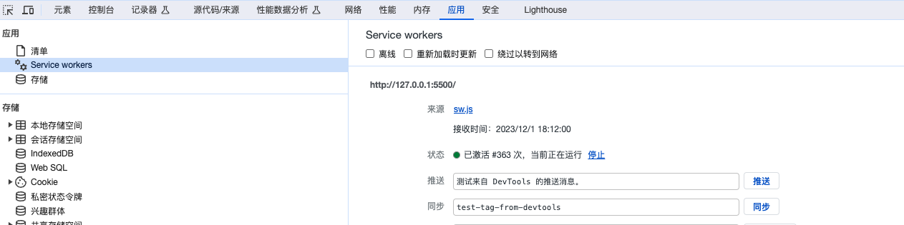
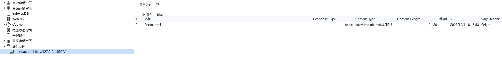
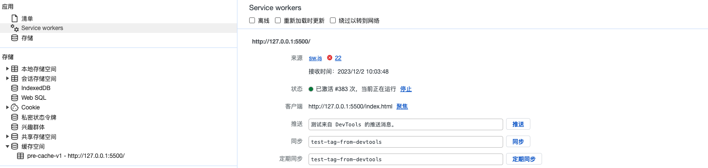

# PWA 离线方案研究报告

本文并不是介绍如何将一个网页配置成离线应用并支持安装下载的。研究PWA的目的仅仅是为了保证用户的资源可以直接从本地加载，来忽略全国或者全球网络质量对页面加载速度造成影响。当然，如果页面上所需的资源，除了资源文件外并不需要任何的网络请求，那它除了不支持**安装到桌面**，已经算是一个离线应用了。

## 什么是PWA

PWA（Progressive Web App）是一种结合了网页和原生应用程序功能的新型应用程序开发方法。PWA 通过使用现代 Web 技术，例如 Service Worker 和 Web App Manifest，为用户提供了类似原生应用的体验。

从用户角度来看，PWA 具有以下特点：
1. 可离线访问：PWA 可以在离线状态下加载和使用，使用户能够在没有网络连接的情况下继续浏览应用；
2. 可安装：用户可以将 PWA 添加到主屏幕，就像安装原生应用一样，方便快捷地访问；
3. 推送通知：PWA 支持推送通知功能，可以向用户发送实时更新和提醒；
4. 响应式布局：PWA 可以适应不同设备和屏幕大小，提供一致的用户体验。

从开发者角度来看，PWA 具有以下优势：
1. 跨平台开发：PWA 可以在多个平台上运行，无需单独开发不同的应用程序；
2. 更新便捷：PWA 的更新可以通过服务器端更新 Service Worker 来实现，用户无需手动更新应用；
3. 可发现性：PWA 可以通过搜索引擎进行索引，增加应用的可发现性；
4. 安全性：PWA 使用 HTTPS 协议传输数据，提供更高的安全性。

总之，PWA 是一种具有离线访问、可安装、推送通知和响应式布局等特点的新型应用开发方法，为用户提供更好的体验，为开发者带来更高的效率。

我们从PWA的各种能力中，聚焦下其**可离线访问**的能力。

## Service Worker

离线加载本质上是页面所需的各种`js`、`css`以及页面本身的`html`，都可以缓存到本地，不再从网络上请求。这个能力是通过`Service Worker`来实现的。

Service Worker 是一种在浏览器背后运行的脚本，用于处理网络请求和缓存数据。它可以拦截和处理网页请求，使得网页能够在离线状态下加载和运行。Service Worker 可以缓存资源，包括 HTML、CSS、JavaScript 和图像等，从而提供更快的加载速度和离线访问能力。它还可以实现推送通知和后台同步等功能，为 Web 应用带来更强大的功能和用户体验。

某些情况下，Service Worker 和浏览器插件的 background 很相似，但在功能和使用方式上有一些区别：

- **功能差异：**Service Worker 主要用于处理网络请求和缓存数据，可以拦截和处理网页请求，实现离线访问和资源缓存等功能。而浏览器插件的 background 主要用于扩展浏览器功能，例如修改页面、拦截请求、操作 DOM 等。  
- **运行环境：**Service Worker 运行在浏览器的后台，独立于网页运行。它可以在网页关闭后继续运行，并且可以在多个页面之间共享状态。而浏览器插件的 background 也在后台运行，但是它的生命周期与浏览器窗口相关，关闭浏览器窗口后插件也会被终止。  
- **权限限制：**由于安全考虑，Service Worker 受到一定的限制，无法直接访问 DOM，只能通过 postMessage() 方法与网页进行通信。而浏览器插件的 background 可以直接操作 DOM，对页面有更高的控制权。

总的来说，Service Worker 更适合用于处理网络请求和缓存数据，提供离线访问和推送通知等功能；而浏览器插件的 background 则更适合用于扩展浏览器功能，操作页面 DOM，拦截请求等。

## 注册

注册一个Service Worker其实是非常简单的，下面举个简单的例子

```html
<!-- index.html -->
<!DOCTYPE html>
<html>
<head>
  <title>Service Worker 示例</title>
</head>
<body>
  <script>
    if ('serviceWorker' in navigator) {
      window.addEventListener('load', function() {
        navigator.serviceWorker.register('/service-worker.js')
          .then(function(registration) {
            console.log('Service Worker 注册成功:', registration.scope);
          })
          .catch(function(error) {
            console.log('Service Worker 注册失败:', error);
          });
      });
    }
  </script>
</body>
</html>
```

```javascript
// service-worker.js

// 定义需要预缓存的文件列表
const filesToCache = [
  '/',
  '/index.html',
  '/styles.css',
  '/script.js',
  '/image.jpg'
];

// 安装Service Worker时进行预缓存
self.addEventListener('install', function(event) {
  event.waitUntil(
    caches.open('my-cache')
      .then(function(cache) {
        return cache.addAll(filesToCache);
      })
  );
});

// 激活Service Worker
self.addEventListener('activate', function(event) {
  event.waitUntil(
    caches.keys().then(function(cacheNames) {
      return Promise.all(
        cacheNames.filter(function(cacheName) {
          return cacheName !== 'my-cache';
        }).map(function(cacheName) {
          return caches.delete(cacheName);
        })
      );
    })
  );
});

// 拦截fetch事件并从缓存中返回响应
self.addEventListener('fetch', function(event) {
  event.respondWith(
    caches.match(event.request)
      .then(function(response) {
        return response || fetch(event.request);
      })
  );
});

```

上述示例中，注册Service Worker的逻辑包含在HTML文件的`<script>`标签中。当浏览器加载页面时，会检查是否支持Service Worker，如果支持，则注册Service Worker文件`/service-worker.js`。

Service Worker文件中，首先定义了需要预缓存的文件列表`filesToCache`。在`install`事件中，将这些文件添加到缓存中。在`activate`事件中，删除旧缓存。在`fetch`事件中，拦截请求并从缓存中返回响应。


Service Worker文件`service-worker.js`需要放置在页面的主域名下。在调用`navigator.serviceWorker.register('/service-worker.js')`时，可以在第二个参数中设置`scope`，用来确定Service Worker的影响范围，默认是sw文件所在path的作用域。

需要注意的是，如果sw文件被放置在`/a`目录下，是不能设置作用域为`/`的。因为文件本身的级别小于根路径。

## 使用

当我们按照上面的示例，配置好了`html`及对应的`sw.js`后，启动服务并刷新页面，应该就能看到控制台打印出了`Service Worker 注册成功`的日志。

如果在chrome浏览器中，可以打开控制台，切换到应用Tab，就能看到我们刚注册好的应用了。


此时在浏览器的缓存空间中，也能发现我们开辟的缓存`my-cache`，内部存储着我们指定的预缓存文件`index.html`。由于我的项目只有根页面，所以只有一个条目。



此时如果页面所需的所有文件都被缓存了，即使将浏览器设置成断网模式，刷新页面也是能打开的。本文的目的并不是创建离线应用，下面我们讲讲上面方式会面临的问题。

### 如何确定预缓存范围

如果我们的项目只有一个仓库，可以使用一些`webpack`插件，可以直接帮我们生成`sw`文件。每次重新构建都会生成新的文件，这样就不用担心多存或者少存文件了。同时，在下一章节的删除旧缓存中，每次更新版本号就好了。

> [Workbox](https://developers.google.com/web/tools/workbox)是一个用于创建离线优先的网络应用程序的JavaScript库。它提供了一套工具和功能，帮助开发人员创建可靠的离线体验，并使网页应用程序能够在网络连接不稳定或断开的情况下正常工作。Workbox可以用于缓存和提供离线资源，实现离线页面导航，处理后台同步和推送通知等功能。它能够简化离线应用程序的开发过程，并提供强大的缓存管理和资源加载能力。

对于有统一配置后台的微前端项目，这个问题有些棘手。

1. 由于有后台管理，更新某个模块的文件很常见，但并不想每次都更新`sw.js`。
2. 由于资源的不确定性，无法在`precache`中列举出所有的资源列表，即使列举出了，可能用户永远也不会用到某个文件，造成缓存浪费或溢出。
3. 出于第1、2条缘由，更新`sw`文件后，无法确定如何删除旧缓存。

对于这个问题，首先确定的是，先在`precache`中列举出所有的基础底座的资源文件，并单独占用一个`cacheName`。

对于剩下的不确定性的业务文件，可以使用动态缓存的方式，这个会在后面具体讲解，也是本文要研究的重点。

### 资源更新

由于刷新页面后，所有资源都从缓存中获取，此时修改`html`后，再刷新浏览器，页面并没有更新。

这个问题其实不用太担心，虽然我们的资源都被缓存了，但是`sw.js`本身是不会被缓存的。即使我们在下一次更新中，删除了页面上注册Service Worker的代码，已经注册的Service Worker也会一直激活，直到我们主动的删除它。

对于一般的SPA项目，上线后资源一般是不变的，如果我们希望更新页面，只需要更新`sw.js`就好。当注册的Service Worker文件发生变化时，浏览器会自动下载新的Service Worker文件，并在下一次访问页面时激活新的Service Worker。

更新文件需要注意几个问题：

1. **删除旧缓存：**   
   
示例代码中，在`activate`阶段，我们执行了删除缓存的逻辑。真实环境中，一般会将`cacheName`带上版本号，每次更新`sw`都更新下版本号。这样每次都会将旧缓存删掉，并重新开辟新版本的缓存。各浏览器对于缓存超出后的处理是不同的，例如`chrome`就是缓存逐出策略。及时的清理缓存，可以防止出现一些奇怪的问题。

```js
const version = 'v1';

const preCacheName = 'pre-cache-'+ version;

// 将后文调用的 ’my-cache‘的位置替换为 preCacheName
```
    
2. **Service Worker 更新不及时：**   
   
同一个域下，只能有一个Service Worker被激活，只有所有该域下的页面都关闭了，下一个注册的Service Worker才能被激活并取代上一个。对于某些用户来说，这个时间太长了。

因此，我们需要在`install`事件中，等待`precache`环节结束后，调用`self.skipWaiting();`来立即激活新的Service Worker，但并不会立即接管控制所有客户端（即浏览器标签页）。这意味着旧的Service Worker仍然会处理当前打开的页面，直到这些页面被关闭或重新加载。

为了确保新的Service Worker可以立即接管所有客户端，在`activate`事件中调用`clients.claim()`方法。这个方法会在新的Service Worker激活后，立即接管所有已打开的页面，而不需要等待这些页面重新加载。这样可以确保新的Service Worker能够立即生效，提供更新的功能和服务。

更改完后的代码如下，这样修改后，`skipWaiting()`和`clients.claim()`方法会在异步操作完成后被调用，确保新的Service Worker在安装完成后立即激活并接管所有客户端。

```js
// 安装Service Worker时进行预缓存
self.addEventListener('install', function (event) {
  event.waitUntil(
    (async function () {
      await caches
        .open(preCacheName)
        .then(function (cache) {
          return cache.addAll(filesToCache);
        })
        .then(() => {
          self.skipWaiting();
        });
    })()
  );
});

// 激活Service Worker
self.addEventListener('activate', function (event) {
  event.waitUntil((async function () {
    await clearOutdateResources();
    self.clients.claim();
  })());
});
```

现在，更新下`index.html`，然后将上述`sw.js`的更新保存，接着刷新两次页面(不要着急，给注册和加载资源一些时间，可以在控制台中观察下Service Worker的活跃状态以及缓存的变化)。



可以在某个时刻，发现同时存在两个Service Worker，一个处于激活状态，是我们正在使用的，另一个处于待激活状态，因为正在进行`install`。此时缓存空间也会同时存在两个版本的缓存，等新的Service Worker激活后，就会删除旧缓存。然后就只存在一个最新的Service Worker了，同时缓存也只剩一个了。

现在每次用户打开新的页面，
- 优先从缓存中获取资源
- 如果发现`sw`文件被更新，安装新的文件
- 文件内会下载新的资源，同时删除旧缓存，并且接管所有页面
- 用户下一次打开新页面或刷新当前页面，就会展示最新的内容

## 能力扩展

基础操作搞定了。但是上面我们还欠了点技术债，即如果不确定到底有哪些资源，怎么动态的做出缓存。不要着急，现在先进行下扩展阅读。

### 缓存的几种策略

当谈到Service Worker缓存策略时，有以下几种常见的策略：

- Cache First（优先缓存）：首先尝试从缓存中获取响应，如果缓存中存在该资源，则直接返回；如果没有缓存或缓存过期，则向网络发送请求。

- Network First（优先网络）：首先尝试从网络获取响应，如果网络请求成功，则返回网络响应；如果网络请求失败，则从缓存中获取响应，即使缓存过期也会返回缓存的响应。

- Cache Only（仅缓存）：只从缓存中获取响应，不向网络发送请求。适用于完全离线可访问的资源。

- Network Only（仅网络）：只从网络获取响应，不使用缓存。适用于需要实时数据的场景。

- Stale-While-Revalidate（同时更新和使用缓存）：首先尝试从缓存中获取响应，如果缓存过期，则向网络发送请求获取最新响应，并更新缓存。同时返回缓存的响应，以便快速展示内容。

上文中我们使用的，就是缓存优先模式。对于不怎么更新或者只有一个仓库的应用来说，使用`sw.js`文件的更新来说已经足够了。毕竟代码写的越多，bug就越多。同比，更新的越频繁，系统就越不稳定。

### Stale-While-Revalidate

其他策略如果有兴趣，可以自行搜索，现在我们来讲下动态缓存是怎么实现的。毕竟对于微服务来说，不更新`sw`是最好的，如果能忘了它就更好了。

上文中我们介绍了`Cache First`，重新附下代码

```js
// 拦截fetch事件并从缓存中返回响应
self.addEventListener('fetch', function (event) {
  event.respondWith(
    caches.match(event.request).then(function (response) {
      return response || fetch(event.request);
    })
  );
});
```

新增一个`mock.js`，脚本会向body中新增一个字符串。将`js`文件使用`script`的方式加载。

```js
// mock.js
const div = document.createElement('div');
div.innerText = 'Hello World';
document.body.appendChild(div);

// index.html
<script src="./mock.js" type="text/javascript"></script>
```

同时调整下`sw`的拦截逻辑。

```js
// 新增runtime缓存
const runtimeCacheName = 'runtime-cache-' + version;

// 符合条件也是缓存优先，但是每次都重新发起网络请求更新缓存
const isStaleWhileRevalidate = (request) => {
  const url = request.url;
  const index = ['http://127.0.0.1:5500/mock.js'].indexOf(url);
  return index !== -1;
};

self.addEventListener('fetch', function (event) {
  event.respondWith(
    // 尝试从缓存中获取响应
    caches.match(event.request).then(function (response) {
      var fetchPromise = fetch(event.request).then(function (networkResponse) {

        // 符合匹配条件才克隆响应并将其添加到缓存中
        if (isStaleWhileRevalidate(event.request)) {
          var responseToCache = networkResponse.clone();
          caches.open(runtimeCacheName).then(function (cache) {
            cache.put(event.request, responseToCache.clone());
          });
        }
        return networkResponse;
      });

      // 返回缓存的响应，然后更新缓存中的响应
      return response || fetchPromise;
    })
  );
});
```

现在每次用户打开新的页面，
- 优先从缓存中获取资源，同时发起一个网络请求
- 有缓存则直接返回缓存，没有则返回一个`fetchPromise`
- `fetchPromise`内部更新符合缓存条件的请求
- 用户下一次打开新页面或刷新当前页面，就会展示最新的内容

通过修改`isStaleWhileRevalidate`中url的匹配条件，就能够控制是否更新缓存。在上面的示例中，我们可以将`index.html`从`precache`列表中移除，放入`runtime`中，或者专门处理下`index.html`的放置规则，去更新`precache`中的缓存。最好不要出现多个缓存桶中存在同一个`request`的缓存，那样就不知道走的到底是哪个缓存了。

一般来说，微前端的应用，资源文件都有个固定的存放位置，文件本身通过在文件名上增加`hash`或版本号来进行区分。我们在`isStaleWhileRevalidate`函数中匹配存放资源位置的路径，这样用户在第二次打开页面时，就可以直接使用缓存了。如果是内嵌页面，可以与平台沟通，是否可以在应用冷起的时候，偷偷访问一个资源页面，提前进行预加载，这样就能在首次打开的时候也享受本地缓存了。

### 缓存过期

即使我们缓存了一些资源文件，例如Iconfont、字体库等只会更新自身内容，但不会变化名称的文件。仅使用`Stale-While-Revalidate`其实也是可以的。用户会在第二次打开页面时看到最新的内容。

但为了提高一些体验，例如，用户半年没打开页面了，突然在今天打开了一下，展示历史的内容就不太合适了，这时候可以增加一个缓存过期的策略。

如果我们使用的是`Workbox`，通过使用`ExpirationPlugin`来实现的。`ExpirationPlugin`是`Workbox`中的一个缓存插件，它允许为缓存条目设置过期时间。示例如下所示

```js
import { registerRoute } from 'workbox-routing';
import { CacheFirst, StaleWhileRevalidate } from 'workbox-strategies';
import { ExpirationPlugin } from 'workbox-expiration';

// 设置缓存的有效期为一小时
const cacheExpiration = {
  maxAgeSeconds: 60 * 60, // 一小时
};

// 使用CacheFirst策略，并应用ExpirationPlugin
registerRoute(
  ({ request }) => request.destination === 'image',
  new CacheFirst({
    cacheName: 'image-cache',
    plugins: [
      new ExpirationPlugin(cacheExpiration),
    ],
  })
);

// 使用StaleWhileRevalidate策略，并应用ExpirationPlugin
registerRoute(
  ({ request }) => request.destination === 'script',
  new StaleWhileRevalidate({
    cacheName: 'script-cache',
    plugins: [
      new ExpirationPlugin(cacheExpiration),
    ],
  })
);
```

或者我们可以实现一下自己的缓存过期策略。首先是增加缓存过期时间。在原本的更新缓存的基础上，设置自己的`cache-control`，然后再放入缓存中。示例中直接删除了原本的`cache-control`，真正使用中，需要判断下，比如`no-cache`类型的资源，就不要使用缓存了。

每次命中缓存时，都会判断下是否过期，如果过期，则直接返回从网络中获取的最新的请求，并更新缓存。

```js
self.addEventListener('fetch', function (event) {
  event.respondWith(
    // 尝试从缓存中获取响应
    caches.match(event.request).then(function (response) {
      var fetchPromise = fetch(event.request).then(function (networkResponse) {
        if (isStaleWhileRevalidate(event.request)) {
          // 检查响应的状态码是否为成功
          if (networkResponse.status === 200) {
            // 克隆响应并将其添加到缓存中
            var clonedResponse = networkResponse.clone();
            // 在存储到缓存之前，设置正确的缓存头部
            var headers = new Headers(networkResponse.headers);
            headers.delete('cache-control');
            headers.append('cache-control', 'public, max-age=3600'); // 设置缓存有效期为1小时

            // 创建新的响应对象并存储到缓存中
            var cachedResponse = new Response(clonedResponse.body, {
              status: networkResponse.status,
              statusText: networkResponse.statusText,
              headers: headers,
            });

            caches.open(runtimeCacheName).then((cache) => {
              cache.put(event.request, cachedResponse);
            });
          }
        }
        return networkResponse;
      });

      // 检查缓存的响应是否存在且未过期
      if (response && !isExpired(response)) {
        return response; // 返回缓存的响应
      }
      return fetchPromise;
    })
  );
});

function isExpired(response) {
  // 从响应的headers中获取缓存的有效期信息
  var cacheControl = response.headers.get('cache-control');
  if (cacheControl) {
    var maxAgeMatch = cacheControl.match(/max-age=(\d+)/);
    if (maxAgeMatch) {
      var maxAgeSeconds = parseInt(maxAgeMatch[1], 10);
      var requestTime = Date.parse(response.headers.get('date'));
      var expirationTime = requestTime + maxAgeSeconds * 1000;

      // 检查当前时间是否超过了缓存的有效期
      if (Date.now() < expirationTime) {
        return false; // 未过期
      }
    }
  }

  return true; // 已过期
}
```

> 从Service Worker发起的请求，可能会被浏览器自身的内存缓存或硬盘缓存捕获，然后直接返回。


### 精确清理缓存

> 下面的内容，默认为微前端应用。

随着微前端应用的更新，会逐渐出现失效的资源文件一直出现在缓存中，时间长了可能会导致缓存溢出。

#### 定时更新

例如以半年为期限，定期更新`sw`文件的版本号，每次更新都会一刀切的将上一个版本中的**动态缓存**干掉，此操作会导致下次加载变慢，因为会重新通过网络请求的方式加载来创建缓存。但如果更新频率控制得当，并且资源拆分合理，用户感知不会很大。

#### 处理不常用缓存

上文中的缓存过期策略，并不适用于此处。因为微服务中资源文件中，只要文件名不变，内容就应该不变。我们只是期望删除超过一定时间没有使用的条目，防止缓存溢出。这里也使用`Stale-While-Revalidate`的原因是为了帮助我们识别长期不使用的`js`文件，方便删除。

本来可以使用`self.registration.periodicSync.register`来创建一个周期性任务，但是由于兼容性问题，放弃了。需要的可自行研究，附上[网址](https://developer.mozilla.org/en-US/docs/Web/API/PeriodicSyncManager)。

这里我们换一个条件。每当有网络请求被触发时，启动一个延迟20s的`debounce`函数，来处理缓存问题。先把之前的清除旧版本缓存的函数改名成`clearOldResources`。然后设定缓存过期时间为10s，刷新两次页面来触发网路请求，20s之后，`runtime`缓存中的`mock.js`就会被删除了。真实场景下，延迟函数和缓存过期都不会这么短，可以设置成5min和3个月。

```js
function debounce(func, delay) {
  let timerId;

  return function (...args) {
    clearTimeout(timerId);

    timerId = setTimeout(() => {
      func.apply(this, args);
    }, delay);
  };
}

const clearOutdateResources = debounce(function () {
  cache
    .open(runtimeCacheName)
    .keys()
    .then(function (requests) {
      requests.forEach(function (request) {
        cache.match(request).then(function (response) {
          // response为匹配到的Response对象
          if (isExpiredWithTime(response, 10)) {
            cache.delete(request);
          }
        });
      });
    });
});

function isExpiredWithTime(response, time) {
  var requestTime = Date.parse(response.headers.get('date'));
  if (!requestTime) {
    return false;
  }
  var expirationTime = requestTime + time * 1000;

  // 检查当前时间是否超过了缓存的有效期
  if (Date.now() < expirationTime) {
    return false; // 未过期
  }
  return true; // 已过期
}
```

重新总结下微前端应用下的缓存配置：

1. 使用版本号，并初始化`preCache`和`runtimeCache`
2. `preCache`中预缓存基座数据，使用`Cache First`策略，`sw`不更新则基座数据不更新
3. `runtimeCache`使用`Stale-While-Revalidate`策略负责动态缓存业务资源的数据，每次访问页面都动态更新一次
4. 使用`debounce`函数，每次访问页面都会延迟清除过期的缓存
5. 如果需要更新`preCache`中的基座数据，则需要升级版本号并重新安装`sw`文件。新服务激活后会删除上一个版本的数据
6. `runtimeCache`和`preCache`不能同时存储一个资源，否则可能导致混乱。

## 最终示例

下面是最终的`sw.js`，我删除掉了缓存过期的逻辑，如有需要请自行从上文代码中获取。顺便我增加了一点点丧心病狂的错误处理逻辑。

理论上，`index.html`应该放入预缓存的列表里，但我懒得写在`Stale-While-Revalidate`里分别更新`preCache`和`runtimeCache`了，相信看完上面内容的你，一定可以自己实现对应逻辑。

如果你用了下面的文件，每次刷新完页面的20s后，runtime的缓存就会被清空，因为我们过期时间只设置了10s。而每次发起请求后的20s后就会进行过期判断。


```js
const version = 'v1';

const preCacheName = 'pre-cache-' + version;
const runtimeCacheName = 'runtime-cache'; // runtime不进行整体清除

const filesToCache = []; // 这里将index.html放到动态缓存里了，为了搭自动更新的便车。这个小项目也没别的需要预缓存的了

const maxAgeSeconds = 10; // 缓存过期时间，单位s

const debounceClearTime = 20; // 延迟清理缓存时间，单位s

// 符合条件也是缓存优先，但是每次都重新发起网络请求更新缓存
const isStaleWhileRevalidate = (request) => {
  const url = request.url;
  const index = [`${self.location.origin}/mock.js`, `${self.location.origin}/index.html`].indexOf(url);
  return index !== -1;
};

/*********************上面是配置代码***************************** */

const addResourcesToCache = async () => {
  return caches.open(preCacheName).then((cache) => {
    return cache.addAll(filesToCache);
  });
};

// 安装Service Worker时进行预缓存
self.addEventListener('install', function (event) {
  event.waitUntil(
    addResourcesToCache().then(() => {
      self.skipWaiting();
    })
  );
});

// 删除上个版本的数据
async function clearOldResources() {
  return caches.keys().then(function (cacheNames) {
    return Promise.all(
      cacheNames
        .filter(function (cacheName) {
          return ![preCacheName, runtimeCacheName].includes(cacheName);
        })
        .map(function (cacheName) {
          return caches.delete(cacheName);
        })
    );
  });
}

// 激活Service Worker
self.addEventListener('activate', function (event) {
  event.waitUntil(
    clearOldResources().finally(() => {
      self.clients.claim();
      clearOutdateResources();
    })
  );
});

// 缓存优先
const isCacheFirst = (request) => {
  const url = request.url;
  const index = filesToCache.findIndex((u) => url.includes(u));
  return index !== -1;
};

function addToCache(cacheName, request, response) {
  try {
    caches.open(cacheName).then((cache) => {
      cache.put(request, response);
    });
  } catch (error) {
    console.error('add to cache error =>', error);
  }
}

async function cacheFirst(request) {
  try {
    return caches
      .match(request)
      .then((response) => {
        if (response) {
          return response;
        }

        return fetch(request).then((response) => {
          // 检查是否成功获取到响应
          if (!response || response.status !== 200) {
            return response; // 返回原始响应
          }

          var clonedResponse = response.clone();
          addToCache(runtimeCacheName, request, clonedResponse);
          return response;
        });
      })
      .catch(() => {
        console.error('match in cacheFirst error', error);
        return fetch(request);
      });
  } catch (error) {
    console.error(error);
    return fetch(request);
  }
}

// 缓存优先，同步更新
async function handleFetch(request) {
  try {
    clearOutdateResources();
    // 尝试从缓存中获取响应
    return caches.match(request).then(function (response) {
      var fetchPromise = fetch(request).then(function (networkResponse) {
        // 检查响应的状态码是否为成功
        if (!networkResponse || networkResponse.status !== 200) {
          return networkResponse;
        }
        // 克隆响应并将其添加到缓存中
        var clonedResponse = networkResponse.clone();
        addToCache(runtimeCacheName, request, clonedResponse);

        return networkResponse;
      });

      // 返回缓存的响应，然后更新缓存中的响应
      return response || fetchPromise;
    });
  } catch (error) {
    console.error(error);
    return fetch(request);
  }
}

self.addEventListener('fetch', function (event) {
  const { request } = event;

  if (isCacheFirst(request)) {
    event.respondWith(cacheFirst(request));
    return;
  }
  if (isStaleWhileRevalidate(request)) {
    event.respondWith(handleFetch(request));
    return;
  }
});

function debounce(func, delay) {
  let timerId;

  return function (...args) {
    clearTimeout(timerId);

    timerId = setTimeout(() => {
      func.apply(this, args);
    }, delay);
  };
}

const clearOutdateResources = debounce(function () {
  try {
    caches.open(runtimeCacheName).then((cache) => {
      cache.keys().then(function (requests) {
        requests.forEach(function (request) {
          cache.match(request).then(function (response) {
            const isExpired = isExpiredWithTime(response, maxAgeSeconds);
            if (isExpired) {
              cache.delete(request);
            }
          });
        });
      });
    });
  } catch (error) {
    console.error('clearOutdateResources error => ', error);
  }
}, debounceClearTime * 1000);

function isExpiredWithTime(response, time) {
  var requestTime = Date.parse(response.headers.get('date'));
  if (!requestTime) {
    return false;
  }
  var expirationTime = requestTime + time * 1000;

  // 检查当前时间是否超过了缓存的有效期
  if (Date.now() < expirationTime) {
    return false; // 未过期
  }
  return true; // 已过期
}
```

## 销毁

离线缓存用得好升职加薪，用不好就删库跑路。除了上面的一点点的防错逻辑，整体的降级方案一定要有。

看到这里，应该已经忘了Service Worker是如何被注册上的吧。没事，我们看个新的脚本。在原本的基础上，我们加了个变量`SW_FALLBACK`，如果离线缓存出问题了，赶紧到管理后台，把对应的值改成`true`。让用户多刷新两次就好了。只要不是彻底的崩溃导致`html`无法更新，这个方案就没问题。

```js
// 如果有问题，将此值改成true
SW_FALLBACK = false;
 
if ('serviceWorker' in navigator) {
  if (!SW_FALLBACK) {
    navigator.serviceWorker
      .register('/eemf-service-worker.js')
      .then((registration) => {
        console.log('Service Worker 注册成功！');
      })
      .catch((error) => {
        console.log('Service Worker 注册失败：', error);
      });
  } else {
    navigator.serviceWorker.getRegistration('/').then((reg) => {
      reg && reg.unregister();
      if(reg){
        window.location.reload();
      }
    });
  }
}
```

对于没有管理后台配置html的项目，可以将上面的脚本移动到`sw-register.js`的脚本中，在html以script的形式加载该脚本，并将该文件缓存设置为`no-cache`，也不要在`sw`中缓存该文件。这样出问题后，覆写下该文件即可。


## 总结

所有要说的，在上面都说完了。PWA的离线方案，是一种很好的解决方案，但是也有其局限性。我们可以直接借助工具[Workbox](https://developers.google.com/web/tools/workbox)，也可以自己实现一个更加灵活的方案。


## 参考文档
- [Service Worker](https://developer.mozilla.org/zh-CN/docs/Web/API/Service_Worker_API)
- [Service worker overview](https://developer.chrome.com/docs/workbox/service-worker-overview/)
- [Workbox](https://developers.google.com/web/tools/workbox)
- GPT问答